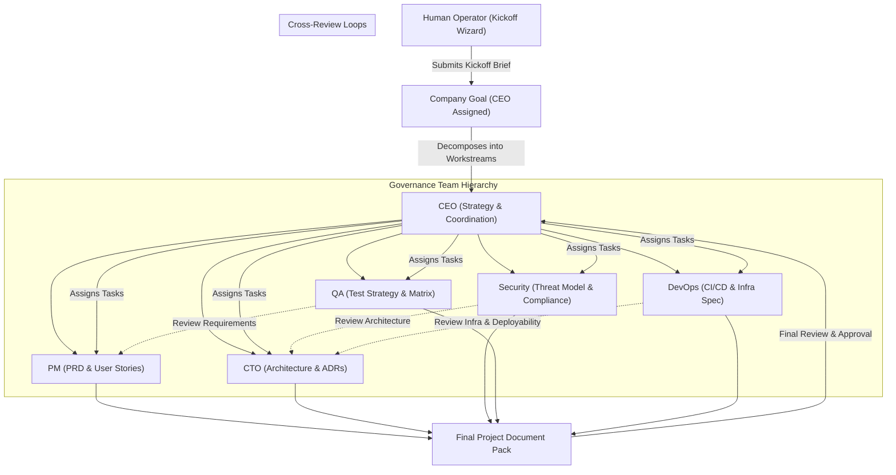

# Phase 3 Plan: Governance Organization & Project Document Generation

## 1. Overview & Objectives

Phase 3 delivers the autonomous **Governance Organization** and **Project Document Generation** workflow for Project Auro.
The control plane enables a human operator to launch a Project Kickoff wizard, which creates a company-level goal assigned to the CEO. The CEO agent then decomposes the goal into workstreams, delegates structured document tasks to direct reports (CTO, PM, QA, DevOps, Security) with dependency tracking, manages cross-review feedback loops, resolves conflicting requirements in issue threads, and compiles the final verified project document pack for human sign-off.

---

## 2. Core Components & Technical Design

### 2.1 Governance Organization Template
- **Hierarchy**: Single root manager (`CEO`), with 5 direct reports (`CTO`, `PM`, `QA`, `DevOps`, `Security`).
- **Prompt Architecture**: Role-specific Markdown prompts stored in `prompts/governance/*.md`:
  - `prompts/governance/ceo.md`: Strategy, workstream decomposition, dependency orchestration, review synthesis, final sign-off.
  - `prompts/governance/cto.md`: Technical architecture, technology stack evaluation, architecture decision records (ADRs), system topology.
  - `prompts/governance/pm.md`: Product requirements document (PRD), feature breakdown, user stories, acceptance criteria, personas.
  - `prompts/governance/qa.md`: QA strategy, test matrix, edge cases, automated test plan, release gates.
  - `prompts/governance/devops.md`: Cloud infrastructure, CI/CD pipelines, containerization, observability, deployment runbooks.
  - `prompts/governance/security.md`: Threat modeling (STRIDE/PASTA), security baseline, authentication/authorization requirements, data privacy.
- **Catalog Integration**: Bundled team package `@paperclipai/teams-catalog` registered under `catalog/bundled/governance/project-governance` with `TEAM.md` and agent definitions referencing versioned prompts.
- **Configuration**:
  - Model mappings backed by `config/models.yaml` (OpenCode models only, with fallback).
  - Role-specific monthly budgets and tool permissions (read/write workspace, task checkout, cross-review comments, document artifact creation).
  - Prompts fully editable via UI managed instructions bundle editor.

### 2.2 Project Kickoff Wizard (UI)
- **Auro Design System**: Adheres strictly to Auro green tokens (`--color-accent-emerald`, CSS design tokens). Zero raw px / hex color violations (`pnpm check:token-gates`).
- **Form Inputs**:
  - `projectName`: Name of the new initiative.
  - `problem`: Problem statement and business context.
  - `targetUsers`: Primary personas and user segments.
  - `goals`: Core measurable objectives and deliverables.
  - `constraints`: Technical, regulatory, budget, and time boundaries.
  - `budget`: Allocated financial/resource budget.
  - `deadline`: Target completion timeframe.
  - `preferredStack`: Desired languages, frameworks, databases, and hosting.
  - `integrations`: Required third-party services and APIs.
  - `teamSizeAndSkills`: Manual team structure, roles, and skills.
  - `attachments`: Links or file attachment references.
- **Action**: Submitting creates a high-level Goal assigned to the CEO agent and triggers the initial heartbeat / kickoff issue.

### 2.3 Document Generation & Orchestration Engine
- **Decomposition**: CEO analyzes the kickoff brief and creates linked sub-tasks with strict dependencies:
  1. *Phase A: Requirements & Threat Modeling* (PM: PRD, Security: Threat Model).
  2. *Phase B: Architecture & Infrastructure* (CTO: Architecture & ADRs, DevOps: Infra Spec).
  3. *Phase C: Quality Assurance & Test Planning* (QA: Test Plan).
- **Cross-Review Mechanism**:
  - Security reviews CTO's Architecture document and leaves structured comments in the issue thread.
  - QA reviews PM's PRD and validates acceptance criteria testability.
  - DevOps reviews CTO's Architecture for deployment constraints.
- **Conflict Resolution**: Agents debate and resolve architectural/scope conflicts in task comments before marking tasks complete.
- **Artifact Deliverables**: Each agent writes standardized Markdown artifacts into the project workspace/issue documents:
  - `docs/PRD.md`, `docs/USER_STORIES.md`
  - `docs/ARCHITECTURE.md`, `docs/ADR-001.md`
  - `docs/THREAT_MODEL.md`
  - `docs/TEST_PLAN.md`
  - `docs/INFRA_SPEC.md`
  - `docs/PROJECT_PACK_SUMMARY.md` (CEO executive synthesis).

---

## 3. Verification Plan & Test Strategy

| Target | Test Suite / Check | Pass Criteria |
|---|---|---|
| **Prompts** | `prompts/governance/*.md` file validation & prompt sync | All 6 role prompt files exist, valid Markdown, non-empty |
| **Catalog Template** | `packages/teams-catalog/src/shipped-catalog.test.ts` & template tests | `project-governance` template passes catalog manifest build & validation |
| **Template Installation** | `server/src/__tests__/governance-template-install.test.ts` | 6 agents created with correct hierarchy, models, budgets, and prompts |
| **Kickoff Wizard** | `ui/src/components/ProjectKickoffWizard.test.tsx` | Form renders all fields, submits goal to CEO, Auro styling compliant |
| **Orchestration Service** | `server/src/services/governance-orchestration.test.ts` | Goal decomposition, task dependency wiring, cross-review, and pack synthesis |
| **Token Gates** | `pnpm check:token-gates` | 0 token gate violations across UI components |
| **Typecheck** | `pnpm -r typecheck` | Clean compilation across all packages |
