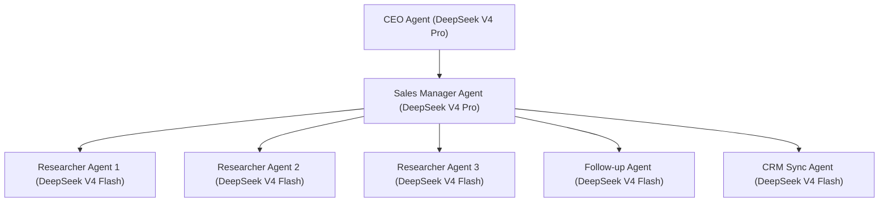

# Phase 4 Plan: Sales & Lead Generation Organization

## 1. Executive Summary & Goals
Phase 4 implements the **Sales & Lead Generation Organization** for Project Auro. It provides an end-to-end autonomous business development pipeline: from campaign configuration to public business research, prompt-injection safeguarded lead validation and scoring, multi-step compliant email drafting, human-in-the-loop approvals, and pluggable CRM synchronization (HubSpot, generic REST/webhook, CSV).

---

## 2. Organization Architecture & Model Mapping

### Approved Model Configuration (`config/models.yaml`)
- **CEO & Sales Manager**: `opencode/deepseek-v4-pro` (Fallback: `opencode/deepseek-v4-flash`)
- **Researcher, Follow-up, CRM Sync**: `opencode/deepseek-v4-flash` (Fallback: `opencode/deepseek-v4-pro`)
- **Versioned System Prompts**:
  - `prompts/sales/ceo.md`: High-level campaign authorization and strategy.
  - `prompts/sales/sales_manager.md`: Lead list qualification, review, and sequence sign-off.
  - `prompts/sales/researcher.md`: Public business data collection, extraction, and verification.
  - `prompts/sales/follow_up.md`: 3-touch personalized email sequence generation (initial + 2 follow-ups).
  - `prompts/sales/crm_sync.md`: Idempotent CRM synchronization, activity logging, and stage mapping.

---

## 3. Core Modules & Execution Pipeline

### A. Lead Campaign Wizard & Brief
- **Parameters**: Campaign Name, Industry & Sub-segment (e.g. *Manufacturing: Auto Components, Machine Tools, Industrial Packaging*), Target Locations (e.g. *Bengaluru Urban/Rural, Peenya, Whitefield, Bommasandra, Hosur*), Company Size (e.g. 10-50, 50-200, 200-1000+), Target Persona/Titles (e.g. *Managing Director, VP Operations, Plant Head, Procurement Director*), Value Proposition & Offer, Daily & Weekly Lead Quotas, Email Sequence Parameters.

### B. Safe Public Web Research & Data Integrity
1. **Public Data Only**: Company name, domain, industry, location, headcount range, decision-maker name & title, public listed contact email/phone, source URL.
2. **Prompt-Injection Defense**: All extracted web/document content is parsed strictly as untrusted data strings. Input sanitization isolates untrusted text in strict delimiters and strips prompt-hijack directives (tested against poisoned HTML payloads).
3. **Deduplication & Validation**: Domain normalization, RFC-compliant email syntax checks, syntax rejection of disposable/scraped private addresses, and lead scoring (0-100).

### C. Compliant Outbound Email Engine
1. **Governed Send Policy**: Hard-coded safety defaults (`dryRun: true`, `requireHumanApproval: true`, daily rate limits, warm-up ramping).
2. **Statutory Compliance** (DPDP Act, CAN-SPAM, GDPR Principles):
   - Clear physical address & sender identity in every email footer.
   - Working 1-click unsubscribe token link with immediate and permanent addition to `email_global_suppressions`.
   - Pre-send suppression verification (address is dropped if hash exists in suppression list).
3. **Connectors**: SMTP transporter, Gmail API connector, and local mock mail sink in test/demo environments.
4. **Deliverability & Guidance**: `docs/compliance-notes.md` (engineering safeguards) and `docs/email-deliverability.md` (SPF, DKIM, DMARC guidance).

### D. Pluggable CRM Integration Layer
- **Interface `CrmConnector`**:
  - `upsertLead(lead: SalesLead): Promise<CrmSyncResult>`
  - `attachTimeline(leadId: string, event: EmailEvent): Promise<void>`
  - `updateStage(leadId: string, stage: LeadStage): Promise<void>`
  - `getSyncStatus(leadId: string): Promise<CrmStatus>`
- **Connectors**: Generic Webhook / REST Connector (configurable headers & payload mapping), HubSpot Connector (OAuth/token), and CSV Export.

---

## 4. UI Surfaces (Auro Design System)
1. **Lead Center**: Data table with industry/location/status filters, lead score badges, source URL links, email timeline modal, bulk actions, and CSV export.
2. **Campaign Wizard**: Green-accented Auro multi-step kickoff form for sales campaigns.
3. **Email Sequence Editor**: 3-step sequence visualizer with merge tags (`{{company_name}}`, `{{contact_name}}`, `{{pain_point}}`) and live preview.
4. **Approvals Inbox**: Review gate for discovered lead batches and drafted email sequences prior to outbound delivery.
5. **Hot Leads & Team Handoff**: Dedicated view flagging leads that replied with positive sentiment, notifying the human team for manual call/meeting follow-up.
6. **Suppression & Metrics Dashboard**: Global opt-out manager and funnel analytics (sent, delivered, opened, replied, bounced, unsubscribed).

---

## 5. Verification Plan
- Unit & integration tests for sales org provisioning, lead extraction & deduplication, poisoned page prompt-injection resilience, email compliance & suppression enforcement, bounce handling, CRM connector idempotency, and route RBAC/tenant isolation.
- Full typechecks, token gates (`pnpm check:token-gates`), and light/dark theme verification across desktop and mobile viewports.
