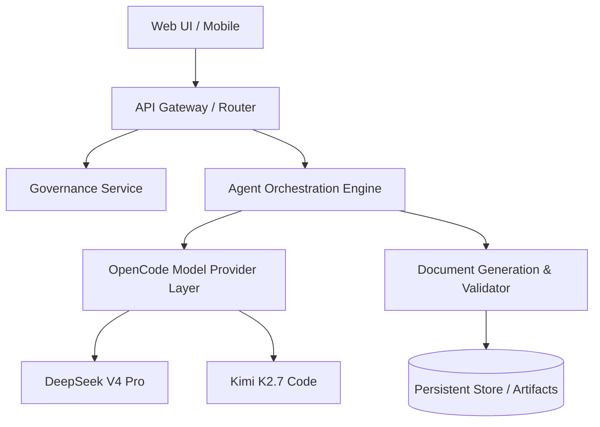
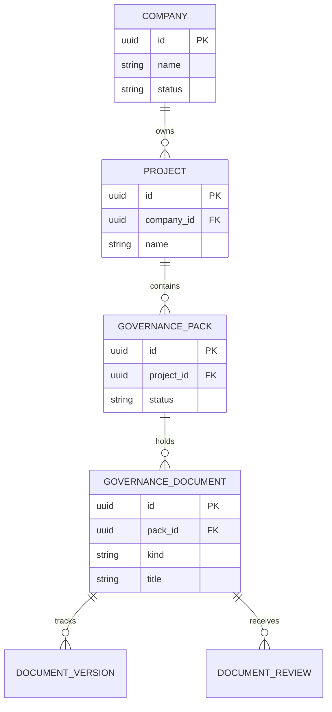

# Complete Project Governance Pack: Project Auro SuperApp
*Generated by Project Auro autonomous governance control plane*

---

<!-- START DOCUMENT: CHARTER.md (charter) -->
# Project Charter & Vision: Project Auro SuperApp
> **Notice: Generated in Demo Mode**

## Executive Summary
Project Auro SuperApp is designed to deliver a modern, autonomous solution for Need autonomous governance and multi-format exports....

## Problem Statement
Need autonomous governance and multi-format exports.

## Target Users & Stakeholders
- Primary Audience: Engineering Leaders
- Key Stakeholders: Executive leadership, product team, and engineering organization.

## Strategic Goals & Success Metrics
- Goals: Ship complete 12-doc governance pack.
- Budget Target: 50000
- Target Timeline: 2026-12-01

## Scope & Non-Goals
### In Scope
- Core workflow automation, project governance pack, agent orchestration.
### Non-Goals
- Legacy on-premise mainframe integrations without API access.

---

<!-- START DOCUMENT: PRD.md (prd) -->
# Product Requirements Document: Project Auro SuperApp
> **Notice: Generated in Demo Mode**

## Product Overview
Project Auro SuperApp addresses critical operational requirements for Engineering Leaders.

## User Journeys & Use Cases
1. **Kickoff Flow**: User inputs project constraints and triggers full governance pack.
2. **Review & Refinement**: Agents cross-review generated artifacts and resolve feedback in-thread.
3. **Delivery Hand-off**: Approved sprint tickets are exported to Jira / XLSX.

## Functional Requirements
- **FR-1 (Kickoff)**: Capture project metadata, team skills (N/A), and constraints.
- **FR-2 (Orchestration)**: CEO delegates workstreams to CTO, PM, QA, DevOps, and Security.
- **FR-3 (Document Generation)**: Produce all 12 validated governance artifacts.

## Non-Functional Requirements
- **Performance**: Document pack compilation under 15 seconds.
- **Reliability**: Automatic model fallback on quota / provider errors.
- **Security**: Strict tenant isolation and sandbox enforcement.

## Acceptance Criteria
- [ ] All 12 documents pass section validator checks.
- [ ] Cross-reviews completed and signed off.
- [ ] Final document pack approved by CEO.

---

<!-- START DOCUMENT: ARCHITECTURE.md (architecture) -->
# System Architecture & ADRs: Project Auro SuperApp
> **Notice: Generated in Demo Mode**

## Architecture Overview
The architecture is structured around modular control plane services, isolated execution sandboxes, and autonomous multi-agent orchestration.

## System Component Diagram (Mermaid)


## Data Flow & Integration Points
- **External Integrations**: Standard REST / Webhooks
- **Preferred Stack**: TypeScript / Node.js / React

## Architectural Decision Records (ADRs)
### ADR-001: Model Provider Layer with Automatic Failover
- **Context**: Relying on a single AI provider causes downtime during quota exhaustion.
- **Decision**: Implement OpenCode provider with transparent fallback to DeepSeek V4 Flash / Pro.
- **Consequences**: Zero agent downtime; seamless quota management.

---

<!-- START DOCUMENT: TECH_STACK.md (tech_stack) -->
# Technology Stack & Justification: Project Auro SuperApp
> **Notice: Generated in Demo Mode**

## Stack Summary Matrix
| Layer | Technology | Version | Purpose |
|---|---|---|---|
| Frontend | React + Vite + Tailwind | React 19 / Vite 6 | Responsive, token-gated UI |
| Backend | Node.js + Express + TypeScript | Node 24 / TS 5.7 | API and orchestration engine |
| Database | PostgreSQL + Drizzle ORM | Postgres 16 | Relational data with type-safe schema |
| AI Adapter | OpenCode Provider Layer | Latest | Multi-model agent execution |

## Frontend & Backend Rationale
- Selection based on project requirements: Modern full-stack TypeScript.
- Shared type packages ensure end-to-end type safety between client and server.

## Database & Storage Layer
- Relational schema managed with strict migration numbering and tenant isolation checks.
- Artifacts and document versions stored with immutable history hashes.

## Third-Party Dependencies & Licensing
- All core dependencies use permissive licenses (MIT / Apache-2.0 / BSD).

---

<!-- START DOCUMENT: DB_OPENAPI.md (db_openapi) -->
# Database Schema (ER) & OpenAPI Specification: Project Auro SuperApp
> **Notice: Generated in Demo Mode**

## Entity-Relationship (ER) Diagram (Mermaid)


## Data Dictionary & Tables
- **governance_packs**: Holds overall pack lifecycle (draft, in_review, approved).
- **governance_documents**: Individual documents with validation states.
- **document_versions**: Content snapshots and author change summaries.

## OpenAPI 3.0 REST Specification Draft
```yaml
openapi: 3.0.3
info:
  title: Project Auro SuperApp Governance API
  version: 1.0.0
paths:
  /api/companies/{companyId}/governance/pack:
    get:
      summary: Retrieve active project governance pack
      responses:
        '200':
          description: Governance pack details
```

---

<!-- START DOCUMENT: EXECUTION_PLAN.md (execution_plan) -->
# Execution Plan & Timeline: Project Auro SuperApp
> **Notice: Generated in Demo Mode**

## Project Phases & Major Milestones
- **Phase 1: Kickoff & Governance Alignment** (Target: Week 1) — Approval of all 12 governance pack documents.
- **Phase 2: Core Platform & Infrastructure** (Target: Weeks 2-3) — Backend services, database migrations, CI/CD pipeline.
- **Phase 3: Feature Development & Validation** (Target: Weeks 4-5) — Functional user stories, test suites, cross-reviews.
- **Phase 4: Release & Hand-off** (Target: 2026-12-01) — Production deployment and user onboarding.

## Timeline & Critical Path
- Critical Path: Architecture & PRD Approval -> Data Schema & API Contract -> Core Implementation -> QA Sign-off.

## Resource Requirements & Capacity
- Budget: 50000
- Team Size: 5-8 engineers
- Skill Coverage: Full-stack development, QA automation, DevOps, Security

---

<!-- START DOCUMENT: SPRINT_PLAN.md (sprint_plan) -->
# Sprint Plan & Backlog Breakdown: Project Auro SuperApp
> **Notice: Generated in Demo Mode**

## Epics Overview
- **EPIC-1 (Core Platform)**: Project setup, API routing, and DB models.
- **EPIC-2 (Document Center)**: Document viewing, markdown editing, versioning, and exports.
- **EPIC-3 (Security & QA)**: Automated test harnesses, RBAC policies, sandbox confinement.

## User Stories & Acceptance Criteria
### US-101: Project Kickoff Initiation
- **As a** Project Lead,
- **I want to** initialize the project governance wizard with stack and team constraints,
- **So that** the autonomous agent organization generates the complete document pack.
- **Estimate**: 5 Story Points | **Priority**: High

### US-102: Document Review & CEO Pack Approval
- **As a** Stakeholder,
- **I want to** inspect cross-agent document reviews and approve the final release pack,
- **So that** tickets can be assigned and exported to Jira / XLSX.
- **Estimate**: 8 Story Points | **Priority**: High

## Engineering Task Breakdown & Dependencies
| Task ID | Description | Assignee Role | Estimate (hrs) | Depends On |
|---|---|---|---|---|
| TASK-01 | Setup Drizzle DB schema & migrations | DevOps / CTO | 4 | None |
| TASK-02 | Implement document validation service | PM / CTO | 6 | TASK-01 |
| TASK-03 | Build Document Center UI & diff viewer | Frontend Lead | 8 | TASK-02 |
| TASK-04 | Setup CI/CD sandbox & test runner | DevOps / QA | 4 | TASK-01 |

---

<!-- START DOCUMENT: TEAM_ALLOCATION.md (team_allocation) -->
# Team Allocation & Capacity Sheet: Project Auro SuperApp
> **Notice: Generated in Demo Mode**

## Team Roster & Skill Matrix
- **Team Size**: 5 Core Members
- **Identified Skills**: TypeScript, React, PostgreSQL, Docker, Security Auditing, Test Automation

| Name | Role | Primary Skills | Weekly Capacity (hrs) |
|---|---|---|---|
| Alice Morgan | Lead Architect | Node.js, Systems, Drizzle, DB | 40 |
| Bob Chen | Frontend Specialist | React, Vite, Tailwind CSS | 40 |
| Carlos Diaz | QA Engineer | Vitest, E2E, Test Planning | 35 |
| Diana Vance | DevOps Engineer | Docker, CI/CD, Linux Sandboxes | 35 |
| Evan Wright | Security Lead | STRIDE, RBAC, Auth Audits | 20 |

## Workstream & Role Assignments
- **Architecture & Backend**: Alice Morgan (Lead), Bob Chen
- **UI & Document Center**: Bob Chen (Lead)
- **Quality Assurance**: Carlos Diaz
- **Infrastructure & Deployments**: Diana Vance
- **Security & Compliance**: Evan Wright

## Capacity Ratios & On-Call Coverage
- Development Capacity: 75%
- Review & Bug Triage: 15%
- Maintenance / On-Call: 10%

---

<!-- START DOCUMENT: TEST_STRATEGY.md (test_strategy) -->
# Test Strategy & QA Checklist: Project Auro SuperApp
> **Notice: Generated in Demo Mode**

## Testing Strategy & Scope
Ensures high reliability for Project Auro SuperApp through deterministic automated testing, contract validation, and sandbox isolation checks.

## Test Levels & Automation Matrix
| Level | Framework | Scope | Gate Threshold |
|---|---|---|---|
| Unit Tests | Vitest | Services, validators, helpers | 100% pass, >85% coverage |
| Integration Tests | Vitest + Supertest | REST endpoints, DB transactions | 100% pass |
| UI Component Tests | Vitest + JSDOM | React components, token gates | 100% pass, 0 token violations |
| Sandbox Security | Isolated runner | Out-of-policy filesystem/network blocks | 0 bypasses |

## Release QA Checklist & Criteria
- [ ] All 12 governance documents pass validation with zero missing sections.
- [ ] Token gates pass cleanly (`pnpm check:token-gates`).
- [ ] RBAC & tenant isolation verified across all endpoints.
- [ ] Fallback executed successfully during model provider simulation.

---

<!-- START DOCUMENT: INFRA_SPEC.md (cicd_infra) -->
# CI/CD Pipeline & Infrastructure Specification: Project Auro SuperApp
> **Notice: Generated in Demo Mode**

## Infrastructure Topology & Environments
- **Stack**: Node.js, PostgreSQL, Docker
- **Staging Environment**: Isolated VPC with automated ephemeral preview deployments.
- **Production Environment**: High-availability container cluster with automated health checks.

## CI/CD Workflow & Build Gates
1. **Pre-flight**: Node version policy check (`check:node-version`), forbidden tokens check.
2. **Compile & Gate**: TypeScript typecheck (`pnpm -r typecheck`), token-gates check (`check:token-gates`).
3. **Automated Test Suite**: Full server, adapter, and UI test runs.
4. **Artifact Build & Packaging**: Docker image build with signed metadata.

## Container & Sandbox Specification
- Linux: Bubblewrap (`bwrap`) sandbox with strictly confined `filesystemScope: workspace` and `networkScope: isolated`.
- Windows / Host: Isolated containerized dev environments.

---

<!-- START DOCUMENT: THREAT_MODEL.md (threat_model) -->
# Threat Model & Security Requirements: Project Auro SuperApp
> **Notice: Generated in Demo Mode**

## STRIDE Threat Analysis
| Threat Category | Potential Vector | Impact | Mitigation Strategy |
|---|---|---|---|
| **Spoofing** | Forged agent identity in REST calls | High | HMAC / Bearer agent API tokens with company scoping |
| **Tampering** | Unsanctioned prompt or document edit | High | Immutable document version logs & audit trail |
| **Repudiation** | Denied mutation of project pack | Medium | Activity log records for every mutating operation |
| **Information Disclosure** | API keys leaked in server logs | Critical | Masked key displays (last 4 chars) & hashed storage |
| **Denial of Service** | Model rate limit exhaustion | High | Automatic OpenCode fallback & exponential backoff |
| **Elevation of Privilege** | Cross-tenant company access | Critical | Company-scoped query gates on every route |

## Security Controls & Mitigations
- AES-256-GCM encryption for stored provider secrets.
- Strict sandbox enforcement preventing unauthorized disk or network traversal.

## Compliance, Secrets & Audit Logging
- All security-relevant actions write to the audit log table.
- Secret keys are never returned in plain text in API responses.

---

<!-- START DOCUMENT: RISK_RACI.md (risk_raci) -->
# Risk Register & RACI Matrix: Project Auro SuperApp
> **Notice: Generated in Demo Mode**

## Project Risk Register & Scoring
| Risk ID | Description | Prob (1-5) | Impact (1-5) | Score | Mitigation |
|---|---|---|---|---|---|
| RISK-01 | Primary model quota exhaustion | 4 | 4 | 16 | Automatic fallback to secondary OpenCode model |
| RISK-02 | Scope creep during document refinement | 3 | 3 | 9 | Strict acceptance criteria and CEO approval gate |
| RISK-03 | Cross-platform sandbox differences | 3 | 4 | 12 | Standardized WSL2 / container deployment guidelines |

## RACI Governance Matrix
| Deliverable / Action | CEO | CTO | PM | QA | DevOps | Security |
|---|---|---|---|---|---|---|
| Project Charter & Vision | **A** | C | C | I | I | I |
| PRD & Requirements | C | C | **A** | C | I | I |
| Architecture & ADRs | I | **A** | C | I | C | C |
| Test Strategy & QA Plan | I | C | C | **A** | I | I |
| CI/CD & Infra Spec | I | C | I | I | **A** | C |
| Threat Model & Security | C | C | I | I | C | **A** |
| Final Pack Sign-off | **A** | C | C | C | C | C |

*Legend: **A** = Accountable, **R** = Responsible, **C** = Consulted, **I** = Informed*

## Contingency & Escalation Procedures
- Critical blockers are escalated directly to the CEO within the task discussion thread.
- Conflicting architectural requirements between Security and CTO trigger an ADR review session.

---
